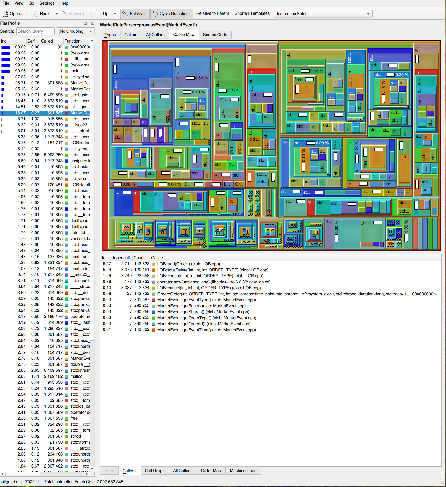
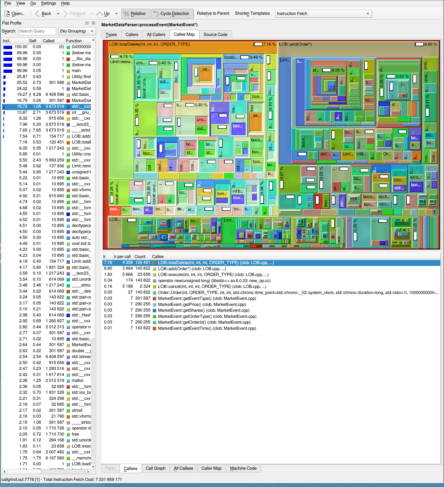
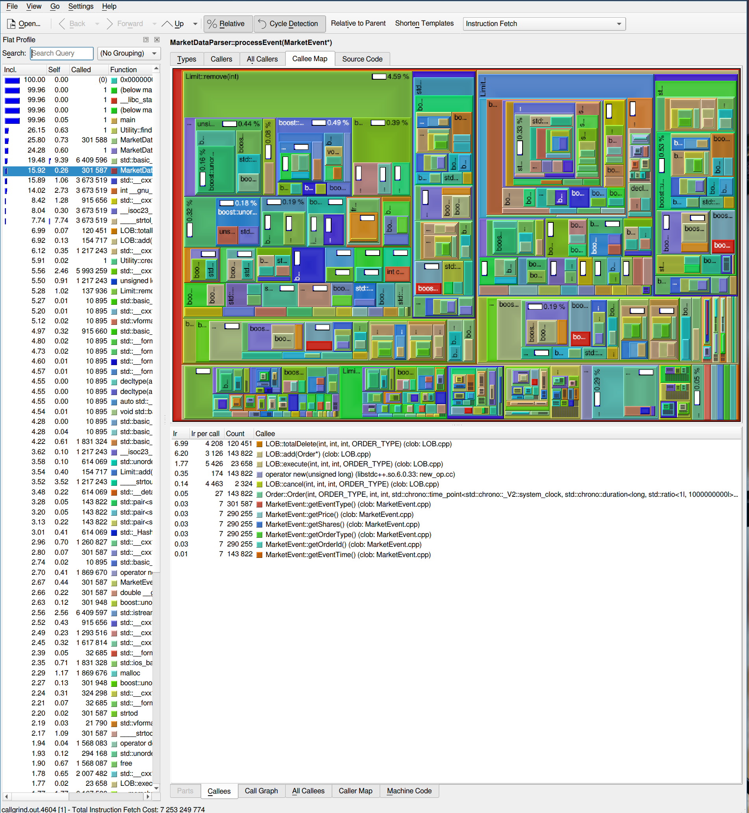

This project uses C++ 23 so you may see newer syntax.

Add operation places an order at the end of a list of orders to be executed at a particular limit price
Cancel operation removes an order from anywhere in the book
Execution removes an order from the inside of the book (the inside of the book is defined as the oldest buy order at the highest buying price and the oldest sell order at the lowest selling price)

### Lobster data format in ./sampleData:

- Time: Seconds after midnight with decimal precision of at least milliseconds and up to nanoseconds depending on the period requested
- Event Type:
  1. Submission of a new limit order
  2. Cancellation (partial deletion of a limit order)
  3. Deletion (total deletion of a limit order)
  4. Execution of a visible limit order
  5. Execution of a hidden limit order
  6. Indicates a cross trade, e.g. auction trade (never occurs in sample data)
  7. Trading halt indicator (detailed information below) (never occurs in sample data)
- Order ID: Unique order reference number
- Size: Number of shares
- Price: Dollar price times 10000 (i.e. a stock price of $91.14 is given by 911400)
- Direction:
  - -1: Sell limit order
  - 1: Buy limit order
  - Note: Execution of a sell (buy) limit order corresponds to a buyer (seller) initiated trade, i.e buy (sell) trade.

### Fixing sample data:

We need to have a utility method that checks all executions or deletions that do not have a corresponding ID. These then need to be added to either the start of day snapshot, or the message before the unmatched execution / deletion.

This is because LOBSTERs data does not include hidden layers in the order book that can be uncovered if a series of cancellations / executions occur and the book significantly moves in one direction. Start of day snapshots using the state of the orderbook at 50 layers deep does not fix this, because the orderbook samples provided by lobster are just Level 1 (price, total volume), and there is no specific order id.

### Creating the binary:

1. Create a subdirectory called build: `mkdir build`
2. Run CMake to generate build files: `cmake ..`
3. Build the project using the generated Makefiles: `cmake --build .`

## Benchmark commands used:

Valgrind --tool=callgrind
Kcachegrind to visualise callgrind output
perf stat
perf

## Benchmark Visualisation

### Kcachegrind Output of the Naive Approach for the processEvent method

### Kcachegrind Output of the Boost Flatmap approach for the processEvent method

### Kcachegrind Output of the Boost Unordered Flatmap and Vector (instead of doubly-linked-list) approach for the processEvent method

